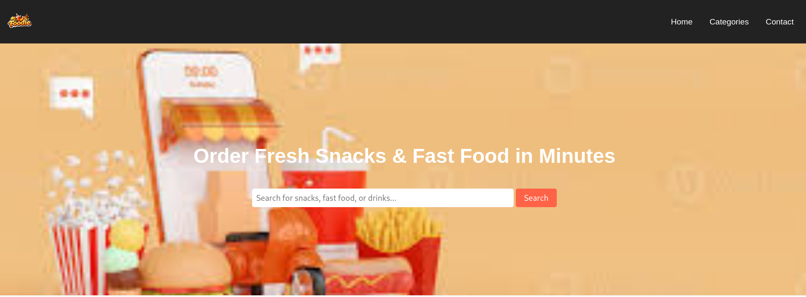

# PHP Practice Project

A hands-on PHP project created to strengthen my understanding of backend development, server-side logic, and web application structure.

## About The Project

This project was built as part of my journey learning PHP through practical implementation instead of only theory. It helped me explore how dynamic web applications work behind the scenes while improving my problem-solving and debugging skills.

## Features

- Dynamic web pages using PHP
- Form handling
- Basic backend logic
- Organized project structure
- Responsive user interface


## Tech Stack

- PHP
- HTML
- CSS
- JavaScript


## What I Learned

Through this project I gained experience with:

- Writing reusable PHP code
- Handling user input
- Connecting frontend and backend functionality
- Debugging and fixing errors
- Structuring small web applications

## Screenshots

### Homepage



### Features Page


## Getting Started

Clone the repository:

```bash
git clone your-repository-link
